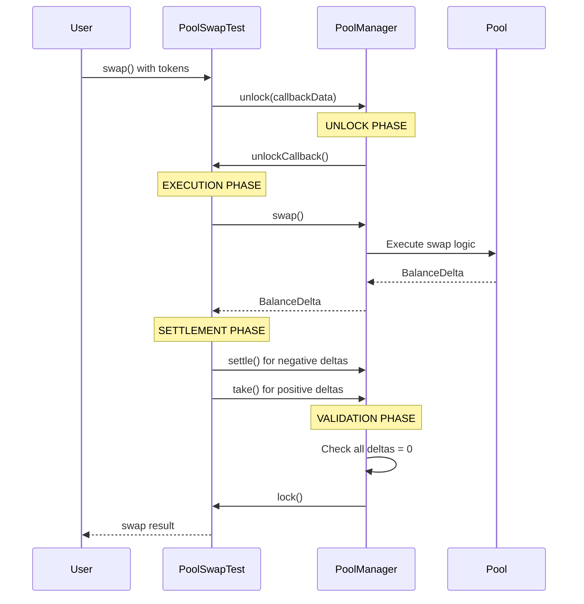

# PoolSwapTest.sol - Uniswap V4 Test Contract Explanation

## 📋 Overview

The `PoolSwapTest.sol` is a **test contract** from Uniswap V4 Core that provides a simplified interface for executing swaps. It's designed for testing and development purposes, but is also used in production for simple swap operations.

## 🎯 Main Purpose

Provides a **user-friendly wrapper** around the complex Uniswap V4 PoolManager swap functionality, handling the unlock/settlement pattern automatically.

## 🔧 Core Components

### Contract Structure
```solidity
contract PoolSwapTest is PoolTestBase {
    using CurrencySettler for Currency;
    using Hooks for IHooks;
}
```

- **Inherits** from `PoolTestBase` (provides balance tracking utilities)
- **Uses** `CurrencySettler` for token settlement operations
- **Uses** `Hooks` for hook validation

### Data Structures

#### `CallbackData` struct:
```solidity
struct CallbackData {
    address sender;           // Who initiated the swap
    TestSettings testSettings; // Settlement behavior settings
    PoolKey key;             // Pool configuration
    SwapParams params;        // Swap parameters
    bytes hookData;          // Additional data for hooks
}
```

#### `TestSettings` struct:
```solidity
struct TestSettings {
    bool takeClaims;         // Whether to take claims during settlement
    bool settleUsingBurn;    // Whether to settle using burn mechanism
}
```

## 🔄 Main Functions

### 1. `swap()` Function
```solidity
function swap(PoolKey memory key, SwapParams memory params, TestSettings memory testSettings, bytes memory hookData)
    external payable returns (BalanceDelta delta)
```

**Purpose:** Main entry point for executing swaps

**Flow:**
1. **Encodes** callback data with all swap parameters
2. **Calls** `manager.unlock()` to enter the unlock pattern
3. **Receives** the swap result (BalanceDelta)
4. **Returns** any leftover ETH to the sender

### 2. `unlockCallback()` Function
This is the **core logic** that executes during the unlock period.

## 🔓 Uniswap V4 Unlock/Settlement Pattern

### What is the Unlock/Settlement Pattern?

The unlock/settlement pattern is Uniswap V4's **revolutionary approach** to handling token transfers and accounting. Instead of immediately transferring tokens during operations, V4 uses a **"flash accounting"** system where operations are executed first, then tokens are settled afterward.

### The Pattern Flow



## 📊 Detailed Execution Flow

### Phase 1: Pre-Swap Validation
```solidity
(,, int256 deltaBefore0) = _fetchBalances(data.key.currency0, data.sender, address(this));
(,, int256 deltaBefore1) = _fetchBalances(data.key.currency1, data.sender, address(this));

require(deltaBefore0 == 0, "deltaBefore0 is not equal to 0");
require(deltaBefore1 == 0, "deltaBefore1 is not equal to 0");
```

- **Checks** initial token balances
- **Ensures** no existing debts before swap
- **Validates** clean state for accurate measurement

### Phase 2: Execute Swap
```solidity
BalanceDelta delta = manager.swap(data.key, data.params, data.hookData);
```

- **Calls** the actual Uniswap V4 swap
- **Returns** the balance delta from the swap

### Phase 3: Post-Swap Validation
```solidity
(,, int256 deltaAfter0) = _fetchBalances(data.key.currency0, data.sender, address(this));
(,, int256 deltaAfter1) = _fetchBalances(data.key.currency1, data.sender, address(this));
```

- **Measures** the actual balance changes
- **Compares** with expected deltas

### Phase 4: Validation Logic

#### For Exact Input Swaps (`amountSpecified < 0`):
```solidity
// User specifies input amount, expects output
require(deltaAfter0 >= data.params.amountSpecified, "Insufficient input");
require(deltaAfter1 >= 0, "Should receive output");
```

#### For Exact Output Swaps (`amountSpecified > 0`):
```solidity
// User specifies output amount, expects input
require(deltaAfter1 <= data.params.amountSpecified, "Too much output");
require(deltaAfter0 <= 0, "Should provide input");
```

### Phase 5: Settlement
```solidity
if (deltaAfter0 < 0) {
    data.key.currency0.settle(manager, data.sender, uint256(-deltaAfter0), data.testSettings.settleUsingBurn);
}
if (deltaAfter1 < 0) {
    data.key.currency1.settle(manager, data.sender, uint256(-deltaAfter1), data.testSettings.settleUsingBurn);
}
if (deltaAfter0 > 0) {
    data.key.currency0.take(manager, data.sender, uint256(deltaAfter0), data.testSettings.takeClaims);
}
if (deltaAfter1 > 0) {
    data.key.currency1.take(manager, data.sender, uint256(deltaAfter1), data.testSettings.takeClaims);
}
```

**Settlement Logic:**
- **Negative deltas** = User owes tokens → **settle()** (transfer tokens to pool)
- **Positive deltas** = Pool owes tokens → **take()** (transfer tokens from pool)

## 💡 Why This Pattern?

### 1. Gas Efficiency
```solidity
// Traditional approach (V3): Multiple token transfers
tokenA.transferFrom(user, pool, amountA);
tokenB.transferFrom(pool, user, amountB);

// V4 approach: Single settlement
// All operations happen in memory, then settle once
```

### 2. Atomic Operations
```solidity
// Multiple operations in one transaction
manager.unlock(data);
// - Swap token A for token B
// - Add liquidity to pool C
// - Swap token B for token D
// All settled atomically at the end
```

### 3. Complex DeFi Strategies
```solidity
// Example: Flash loan + swap + repay
manager.unlock(data);
// 1. Borrow tokens from pool A
// 2. Swap on pool B
// 3. Repay pool A with profits
// All in one atomic transaction
```

## 🔧 Transient Storage Usage

Uniswap V4 uses **EIP-1153 Transient Storage** for the unlock pattern:

```solidity
// Simplified transient storage operations
library Lock {
    function unlock() internal {
        assembly {
            tstore(LOCK_SLOT, 1)  // Set lock in transient storage
        }
    }
    
    function isUnlocked() internal view returns (bool) {
        assembly {
            return(tload(LOCK_SLOT))  // Read from transient storage
        }
    }
}
```

**Benefits:**
- **Cheaper** than regular storage
- **Automatically cleared** at transaction end
- **Perfect** for temporary state

## 🎯 Delta Accounting

The pattern tracks **balance deltas** instead of absolute balances:

```solidity
// Example: User swaps 1 ETH for 2500 USDC
// Before swap: delta0 = 0, delta1 = 0
// After swap:  delta0 = -1 ETH, delta1 = +2500 USDC
// After settlement: delta0 = 0, delta1 = 0
```

## 🛡️ Security Benefits

1. **Reentrancy Protection:** Lock prevents reentrant calls
2. **Atomic Settlement:** All-or-nothing execution
3. **Debt Prevention:** Forces all deltas to be settled
4. **State Consistency:** Ensures clean state after operations

## 🔄 Real-World Example

```solidity
// User wants to swap 1 ETH for USDC
// 1. unlock() - Enter unlocked state
// 2. swap() - Execute swap logic, record deltas
//    - Pool state updated
//    - delta0 = -1 ETH (user owes)
//    - delta1 = +2500 USDC (pool owes)
// 3. settle() - Transfer 1 ETH from user to pool
// 4. take() - Transfer 2500 USDC from pool to user
// 5. lock() - Verify all deltas = 0, exit unlocked state
```

## 🎯 Key Features

1. **Automatic Settlement:** Handles token transfers automatically
2. **Validation:** Ensures swap results match expectations
3. **Flexible Settings:** Configurable settlement behavior
4. **Hook Support:** Passes hook data to pool manager
5. **ETH Handling:** Properly manages native ETH alongside ERC20 tokens

## 🚀 Usage in DetoxHook

The `SwapRouterFixed.sol` contract uses `PoolSwapTest` as its underlying swap engine:

```solidity
// In SwapRouterFixed.sol
delta = poolSwapTest.swap{value: msg.value}(
    poolKey,
    swapParams,
    defaultTestSettings,
    updateData
);
```

## 💡 Why Use This Contract?

1. **Simplified Interface:** Hides complex Uniswap V4 unlock/settlement logic
2. **Automatic Validation:** Ensures swap results are correct
3. **Production Ready:** Used in real applications, not just tests
4. **Gas Efficient:** Optimized for common swap patterns

## 🔍 Key Insights

1. **No Immediate Transfers:** Tokens aren't moved during the operation
2. **Delta Tracking:** All changes are recorded as deltas
3. **Settlement Required:** Deltas must be resolved before exiting
4. **Atomic Execution:** Either everything succeeds or everything fails
5. **Gas Optimization:** Multiple operations can share settlement costs

## 📚 References

- [Uniswap V4 Documentation](https://docs.uniswap.org/contracts/v4/overview)
- [Flash Accounting Guide](https://docs.uniswap.org/contracts/v4/guides/custom-accounting)
- [EIP-1153 Transient Storage](https://eips.ethereum.org/EIPS/eip-1153)
- [PoolSwapTest Source](https://github.com/uniswap/v4-core/blob/main/src/test/PoolSwapTest.sol)

---

The `PoolSwapTest` essentially **abstracts away** the complexity of Uniswap V4's flash accounting system, providing a simple interface for executing swaps while handling all the settlement details automatically!

**🛡️ This pattern is fundamental to Uniswap V4's efficiency and enables complex DeFi operations that would be impossible or prohibitively expensive in previous versions!** 