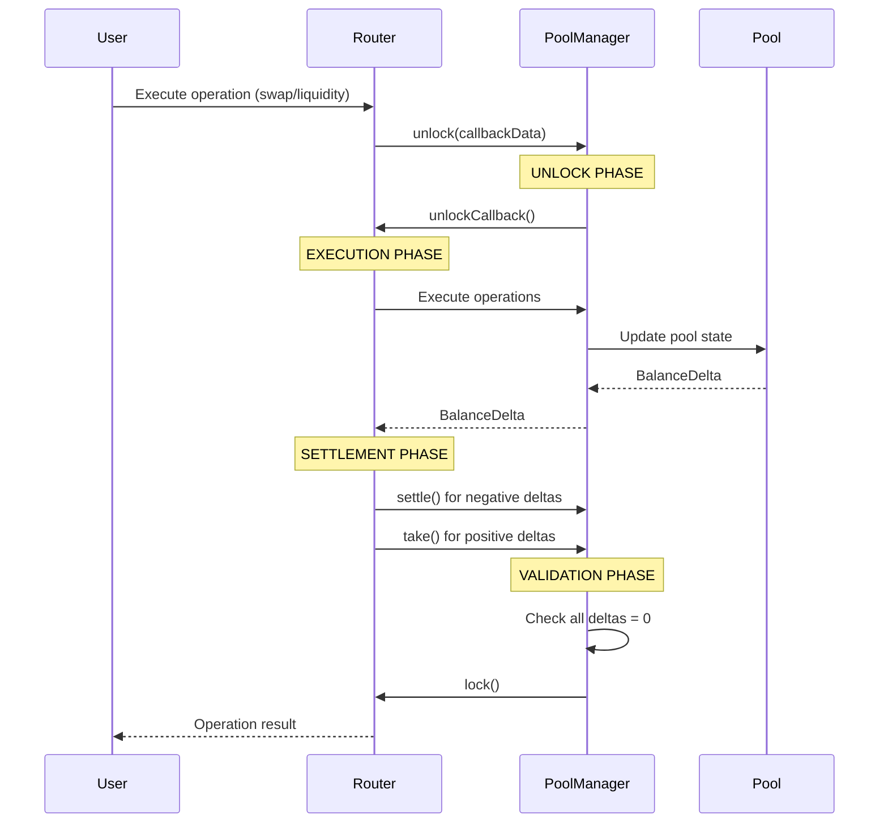

# Uniswap V4 Unlock/Settlement Pattern

## 🔓 What is the Unlock/Settlement Pattern?

The unlock/settlement pattern is Uniswap V4's **revolutionary approach** to handling token transfers and accounting. Instead of immediately transferring tokens during operations, V4 uses a **"flash accounting"** system where operations are executed first, then tokens are settled afterward.

This pattern is **fundamental to Uniswap V4's efficiency** and enables complex DeFi operations that would be impossible or prohibitively expensive in previous versions.

## 🔄 The Pattern Flow



## 📊 Detailed Breakdown

### Phase 1: Unlock (Entry)
```solidity
// In PoolSwapTest.sol
delta = abi.decode(
    manager.unlock(abi.encode(CallbackData(msg.sender, testSettings, key, params, hookData))), 
    (BalanceDelta)
);
```

**What happens:**
1. **PoolManager.unlock()** is called
2. **Transient storage** is used to mark the manager as "unlocked"
3. **Execution control** is passed to the callback function
4. **All subsequent operations** happen within this unlocked state

### Phase 2: Execution (During Unlock)
```solidity
// Execute the actual operation
BalanceDelta delta = manager.swap(data.key, data.params, data.hookData);
// or
BalanceDelta delta = manager.modifyLiquidity(data.key, data.params, data.hookData);
```

**What happens:**
1. **Operation logic** is executed (swap, liquidity modification, etc.)
2. **Pool state** is updated (price, liquidity, etc.)
3. **Balance deltas** are recorded in transient storage
4. **No actual token transfers** occur yet

### Phase 3: Settlement (During Unlock)
```solidity
// Handle negative deltas (user owes tokens)
if (deltaAfter0 < 0) {
    data.key.currency0.settle(manager, data.sender, uint256(-deltaAfter0), data.testSettings.settleUsingBurn);
}
if (deltaAfter1 < 0) {
    data.key.currency1.settle(manager, data.sender, uint256(-deltaAfter1), data.testSettings.settleUsingBurn);
}

// Handle positive deltas (pool owes tokens)
if (deltaAfter0 > 0) {
    data.key.currency0.take(manager, data.sender, uint256(deltaAfter0), data.testSettings.takeClaims);
}
if (deltaAfter1 > 0) {
    data.key.currency1.take(manager, data.sender, uint256(deltaAfter1), data.testSettings.takeClaims);
}
```

**What happens:**
1. **Negative deltas** = User owes tokens → **settle()** transfers tokens TO the pool
2. **Positive deltas** = Pool owes tokens → **take()** transfers tokens FROM the pool
3. **All deltas** must be resolved to zero

### Phase 4: Validation & Lock (Exit)
```solidity
// In PoolManager.sol
function unlock(bytes calldata data) external override returns (bytes memory result) {
    if (Lock.isUnlocked()) AlreadyUnlocked.selector.revertWith();
    
    Lock.unlock();
    result = IUnlockCallback(msg.sender).unlockCallback(data);
    
    if (NonzeroDeltaCount.read() != 0) CurrencyNotSettled.selector.revertWith();
    Lock.lock();
}
```

**What happens:**
1. **Checks** that all deltas are settled (NonzeroDeltaCount = 0)
2. **Reverts** if any debts remain unpaid
3. **Locks** the manager again
4. **Returns** the operation result

## 💡 Why This Pattern?

### 1. Gas Efficiency
```solidity
// Traditional approach (V3): Multiple token transfers
tokenA.transferFrom(user, pool, amountA);
tokenB.transferFrom(pool, user, amountB);

// V4 approach: Single settlement
// All operations happen in memory, then settle once
```

**Benefits:**
- **Reduced gas costs** for complex operations
- **Batch settlement** for multiple operations
- **Eliminates redundant transfers**

### 2. Atomic Operations
```solidity
// Multiple operations in one transaction
manager.unlock(data);
// - Swap token A for token B
// - Add liquidity to pool C
// - Swap token B for token D
// All settled atomically at the end
```

**Benefits:**
- **All-or-nothing execution**
- **No partial state changes**
- **Complex DeFi strategies** in single transaction

### 3. Complex DeFi Strategies
```solidity
// Example: Flash loan + swap + repay
manager.unlock(data);
// 1. Borrow tokens from pool A
// 2. Swap on pool B
// 3. Repay pool A with profits
// All in one atomic transaction
```

**Benefits:**
- **Flash loans** without separate contracts
- **Arbitrage strategies** in single transaction
- **MEV protection** through atomic execution

## 🔧 Transient Storage Usage

Uniswap V4 uses **EIP-1153 Transient Storage** for the unlock pattern:

```solidity
// Simplified transient storage operations
library Lock {
    function unlock() internal {
        assembly {
            tstore(LOCK_SLOT, 1)  // Set lock in transient storage
        }
    }
    
    function isUnlocked() internal view returns (bool) {
        assembly {
            return(tload(LOCK_SLOT))  // Read from transient storage
        }
    }
    
    function lock() internal {
        assembly {
            tstore(LOCK_SLOT, 0)  // Clear lock in transient storage
        }
    }
}
```

**Benefits:**
- **Cheaper** than regular storage
- **Automatically cleared** at transaction end
- **Perfect** for temporary state
- **No storage bloat** from temporary locks

## 🎯 Delta Accounting

The pattern tracks **balance deltas** instead of absolute balances:

```solidity
// Example: User swaps 1 ETH for 2500 USDC
// Before swap: delta0 = 0, delta1 = 0
// After swap:  delta0 = -1 ETH, delta1 = +2500 USDC
// After settlement: delta0 = 0, delta1 = 0
```

**Delta Tracking:**
- **Negative deltas** = User owes tokens to pool
- **Positive deltas** = Pool owes tokens to user
- **Zero deltas** = Balanced state

## 🛡️ Security Benefits

### 1. Reentrancy Protection
```solidity
modifier onlyWhenUnlocked() {
    if (!Lock.isUnlocked()) ManagerLocked.selector.revertWith();
    _;
}
```

**Protection:**
- **Prevents reentrant calls** during operations
- **Ensures single execution path**
- **Protects against flash loan attacks**

### 2. Atomic Settlement
```solidity
if (NonzeroDeltaCount.read() != 0) CurrencyNotSettled.selector.revertWith();
```

**Protection:**
- **All-or-nothing execution**
- **No partial state changes**
- **Forces complete settlement**

### 3. Debt Prevention
```solidity
// Ensures all debts are settled
require(deltaAfter0 == 0, "Unsettled delta0");
require(deltaAfter1 == 0, "Unsettled delta1");
```

**Protection:**
- **Forces all deltas to be settled**
- **Prevents debt accumulation**
- **Ensures clean state**

### 4. State Consistency
```solidity
// Validates state before and after operations
(,, int256 deltaBefore0) = _fetchBalances(currency0, sender, address(this));
// ... execute operation ...
(,, int256 deltaAfter0) = _fetchBalances(currency0, sender, address(this));
```

**Protection:**
- **Validates clean state** before operations
- **Ensures accurate accounting**
- **Prevents state corruption**

## 🔄 Real-World Examples

### Example 1: Simple Swap
```solidity
// User wants to swap 1 ETH for USDC
// 1. unlock() - Enter unlocked state
// 2. swap() - Execute swap logic, record deltas
//    - Pool state updated
//    - delta0 = -1 ETH (user owes)
//    - delta1 = +2500 USDC (pool owes)
// 3. settle() - Transfer 1 ETH from user to pool
// 4. take() - Transfer 2500 USDC from pool to user
// 5. lock() - Verify all deltas = 0, exit unlocked state
```

### Example 2: Complex Multi-Operation
```solidity
// User wants to: borrow ETH → swap for USDC → add liquidity
manager.unlock(data);
// 1. Borrow 10 ETH from pool A (delta0 = -10 ETH)
// 2. Swap 5 ETH for 12500 USDC (delta0 = -5 ETH, delta1 = +12500 USDC)
// 3. Add liquidity to pool B (delta0 = +3 ETH, delta1 = +7500 USDC)
// 4. Settle all deltas atomically
// 5. lock() - All deltas = 0
```

### Example 3: Flash Loan Strategy
```solidity
// Arbitrage strategy: borrow → swap → repay
manager.unlock(data);
// 1. Borrow 1000 USDC from pool A
// 2. Swap 1000 USDC for 0.4 ETH on pool B
// 3. Swap 0.4 ETH for 1010 USDC on pool C
// 4. Repay 1000 USDC to pool A
// 5. Keep 10 USDC profit
// All in one atomic transaction!
```

## 🎯 Key Insights

### 1. No Immediate Transfers
- **Tokens aren't moved** during the operation
- **All transfers happen** during settlement phase
- **Enables complex operations** without intermediate transfers

### 2. Delta Tracking
- **All changes recorded** as deltas in transient storage
- **Real-time accounting** without storage writes
- **Efficient state management**

### 3. Settlement Required
- **Deltas must be resolved** before exiting unlock state
- **Forces complete operations**
- **Prevents partial executions**

### 4. Atomic Execution
- **Either everything succeeds** or everything fails
- **No intermediate states**
- **Perfect for complex DeFi strategies**

### 5. Gas Optimization
- **Multiple operations** can share settlement costs
- **Reduced storage operations**
- **Efficient for complex strategies**

## 🔍 Comparison with Previous Versions

### Uniswap V3 Approach:
```solidity
// Immediate transfers during operations
function swap() external {
    // Transfer input tokens immediately
    tokenA.transferFrom(msg.sender, address(this), amountIn);
    
    // Execute swap logic
    // ...
    
    // Transfer output tokens immediately
    tokenB.transfer(msg.sender, amountOut);
}
```

### Uniswap V4 Approach:
```solidity
// Deferred settlement pattern
function swap() external {
    // Enter unlock state
    manager.unlock(callbackData);
    
    // Execute swap logic (no transfers yet)
    // Record deltas in transient storage
    
    // Settle all transfers at once
    // Exit unlock state
}
```

## 📚 References

- [Uniswap V4 Documentation](https://docs.uniswap.org/contracts/v4/overview)
- [Flash Accounting Guide](https://docs.uniswap.org/contracts/v4/guides/custom-accounting)
- [EIP-1153 Transient Storage](https://eips.ethereum.org/EIPS/eip-1153)
- [Uniswap V4 Whitepaper](https://uniswap.org/whitepaper-v4.pdf)

---

**🛡️ The unlock/settlement pattern is the cornerstone of Uniswap V4's efficiency and enables the next generation of DeFi applications!** 