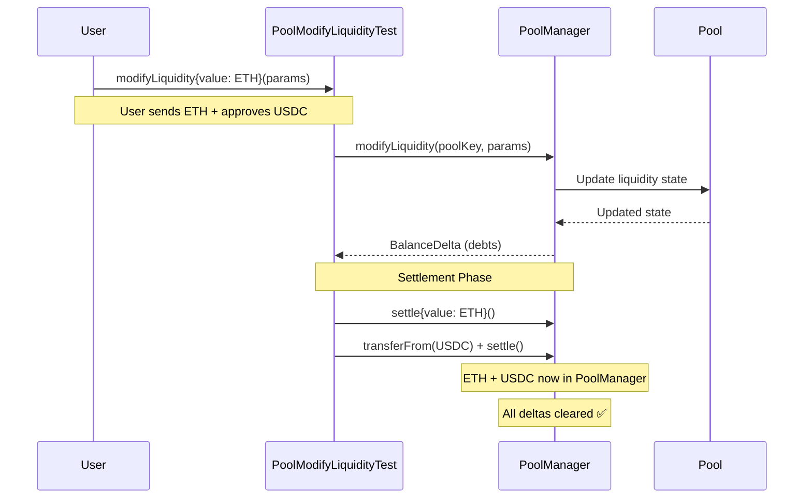

# Provide Liquidity Script Documentation

## 📋 Overview

The `provide_liquidity.py` script is a comprehensive Python tool for adding liquidity to Uniswap V4 pools on Arbitrum Sepolia. It integrates with the DetoxHook ecosystem and handles all necessary token approvals and calculations.

## 🎯 Main Purpose

Provides liquidity to Uniswap V4 pools in the DetoxHook ecosystem by interacting with the deployed pool infrastructure.

## 🔧 Core Components

1. **Pool Configuration Loading** - Reads pool configs from `detox-hook-pools.json`
2. **Balance Checking** - Verifies ETH and USDC balances
3. **Token Approval Management** - Handles USDC approvals
4. **Liquidity Calculation** - Calculates required token amounts
5. **Transaction Execution** - Sends liquidity provision transactions

## 🎯 What is `POOL_MODIFY_LIQUIDITY_TEST_ADDRESS`?

**`POOL_MODIFY_LIQUIDITY_TEST_ADDRESS = "0x9A8ca723F5dcCb7926D00B71deC55c2fEa1F50f7"`** is the address of the **`PoolModifyLiquidityTest`** contract.

### 📋 Purpose of `PoolModifyLiquidityTest`:

1. **Test Contract from Uniswap V4 Core** - It's imported from `@uniswap/v4-core/src/test/PoolModifyLiquidityTest.sol`

2. **Liquidity Management Interface** - Provides a simple interface to add/remove liquidity to Uniswap V4 pools

3. **Wrapper for PoolManager** - Acts as a user-friendly wrapper around the complex PoolManager contract

4. **Token Handling** - Handles both ETH (native currency) and ERC20 tokens (like USDC)

### 🔧 How it's Used in `provide_liquidity.py`:

1. **Token Approvals** (Line 297):
   ```python
   spender = Web3.to_checksum_address(self.POOL_MODIFY_LIQUIDITY_TEST_ADDRESS)
   # Check if USDC is approved for this contract
   usdc_allowance = usdc_contract.functions.allowance(checksum_address, spender).call()
   ```

2. **Contract Interaction** (Line 379):
   ```python
   liquidity_contract = self.w3.eth.contract(
       address=Web3.to_checksum_address(self.POOL_MODIFY_LIQUIDITY_TEST_ADDRESS),
       abi=self.POOL_MODIFY_LIQUIDITY_TEST_ABI
   )
   ```

3. **Liquidity Provision** (Line 449):
   ```python
   transaction = liquidity_contract.functions.modifyLiquidity(
       pool_key_tuple,
       modify_params,
       hook_data
   ).build_transaction(tx_params)
   ```

### 🎯 Why Use This Contract?

1. **Simplified Interface** - The PoolManager is complex; this provides an easier interface
2. **Testing Origin** - Originally designed for testing, but works for real liquidity provision
3. **ETH Handling** - Properly handles native ETH alongside ERC20 tokens
4. **Proven Reliability** - Used throughout the Uniswap V4 ecosystem

### 📊 Transaction Flow:

```
User Wallet → approve USDC → PoolModifyLiquidityTest → PoolManager → Uniswap V4 Pool
     ↓                                    ↓
   ETH + USDC                        modifyLiquidity()
```

### 🎯 Key Functions:

- **`modifyLiquidity()`** - Main function to add/remove liquidity
- Takes pool key, liquidity parameters, and hook data
- Handles both ETH (sent as `msg.value`) and ERC20 tokens
- Returns the balance delta from the operation

The `POOL_MODIFY_LIQUIDITY_TEST_ADDRESS` is essentially the **"liquidity router"** that makes it easy to interact with Uniswap V4 pools without dealing with the complexity of the PoolManager directly!

## 🔄 Uniswap V4 Settlement Mechanism

### ⏱️ Timeline of Token Movement:

1. **During `modifyLiquidity()` Call:**
   - ✅ **Balance deltas are recorded** in transient storage
   - ❌ **No actual token transfers happen yet**
   - ✅ **Pool liquidity state is updated**
   - ✅ **BalanceDelta is returned** showing what's owed

2. **During Settlement Actions:**
   - ✅ **Actual token transfers occur**
   - ✅ **Debts are cleared**

### 🎯 Detailed Settlement Mechanism:

#### For ETH (Native Currency):
```python
# When providing liquidity with ETH
modifyLiquidityRouter.modifyLiquidity{value: ethAmount}(poolKey, params, "")
#                                    ↑ ETH sent with transaction

# Inside PoolModifyLiquidityTest:
# 1. Receives ETH as msg.value
# 2. Calls PoolManager.modifyLiquidity() 
# 3. PoolManager records delta: "Router owes X ETH to pool"
# 4. PoolModifyLiquidityTest calls PoolManager.settle() with ETH
# 5. ETH is transferred from PoolModifyLiquidityTest to PoolManager
```

#### For USDC (ERC20 Token):
```python
# Before calling modifyLiquidity:
usdc.approve(address(modifyLiquidityRouter), amount)

# During modifyLiquidity call:
# 1. PoolManager records delta: "Router owes X USDC to pool"
# 2. PoolModifyLiquidityTest calls USDC.transferFrom(user, poolManager, amount)
# 3. PoolModifyLiquidityTest calls PoolManager.settle()
# 4. USDC tokens are now in PoolManager
```

### 🔧 The `PoolModifyLiquidityTest` Contract Role:

The `PoolModifyLiquidityTest` contract acts as an **intermediary** that:

1. **Receives tokens** from users (ETH as msg.value, USDC via transferFrom)
2. **Calls PoolManager** to create liquidity positions
3. **Settles the debts** by transferring tokens to PoolManager
4. **Handles the accounting** to ensure all deltas are cleared

### 📊 Exact Token Flow:



### 🎯 Key Insights:

1. **Immediate Effects:**
   - Pool liquidity state updates immediately
   - Deltas (debts) are recorded in transient storage
   - No tokens move yet

2. **Settlement Phase:**
   - `PoolModifyLiquidityTest` transfers ETH and USDC to PoolManager
   - PoolManager verifies the transfers match the recorded debts
   - Deltas are cleared to zero

3. **Security Mechanism:**
   - If deltas aren't settled, the transaction reverts
   - This prevents incomplete operations and ensures atomicity

### 💡 Why This Design?

1. **Gas Efficiency:** Multiple operations can be batched before settlement
2. **Flexibility:** Complex multi-step operations in a single transaction
3. **Security:** Atomic settlement ensures all-or-nothing execution
4. **Composability:** Enables advanced DeFi strategies

The tokens are **physically moved** during the settlement calls (`PoolManager.settle()`), not during the `modifyLiquidity()` call itself. The `PoolModifyLiquidityTest` contract handles this settlement automatically, making it seamless for users!

## 🚀 Usage Examples

### Basic Usage:
```bash
# Provide liquidity using environment wallet
python3 provide_liquidity.py --env-wallet 0x5e6967b5ca922ff1aa7f25521cfd03d9a59c17536caa09ba77ed0586c238d23f --usdc-amount 100

# Provide liquidity with specific wallet
python3 provide_liquidity.py 0x1234... 0x5e6967b5... --eth-amount 0.1

# List available pools
python3 provide_liquidity.py --list-pools --verbose

# Dry run simulation
python3 provide_liquidity.py --env-wallet 0x5e6967b5... --usdc-amount 50 --dry-run
```

### Environment Variables:
- `ARBITRUM_SEPOLIA_RPC_URL` - RPC endpoint
- `DEPLOYMENT_WALLET` - Default wallet address
- `PRIVATE_KEY` or `DEPLOYMENT_KEY` - Private key for signing

## 🔍 Troubleshooting

### Common Issues:

1. **Insufficient Balance:**
   ```
   ❌ Insufficient ETH balance. Need 0.000400 ETH, have 0.000200 ETH
   ```
   **Solution:** Fund the wallet with more ETH/USDC

2. **USDC Approval Required:**
   ```
   ❌ USDC approval required. Please approve USDC for the liquidity contract first.
   ```
   **Solution:** Approve USDC for the `PoolModifyLiquidityTest` contract

3. **Pool Not Found:**
   ```
   ❌ Pool 0x5e6967b5... not found in configuration
   ```
   **Solution:** Check pool ID or use `--list-pools` to see available pools

### Debug Commands:
```bash
# Check wallet balances
python3 check_balances.py

# Verify pool configuration
python3 provide_liquidity.py --list-pools --verbose

# Test with dry run
python3 provide_liquidity.py --env-wallet <pool_id> --usdc-amount 1 --dry-run --verbose
```

## 📚 References

- [Uniswap V4 Documentation](https://docs.uniswap.org/contracts/v4/overview)
- [Flash Accounting Guide](https://docs.uniswap.org/contracts/v4/guides/custom-accounting)
- [PoolModifyLiquidityTest Source](https://github.com/uniswap/v4-core/blob/main/src/test/PoolModifyLiquidityTest.sol)
- [DetoxHook Documentation](../README.md)

---

**🛡️ DetoxHook represents the future of fair DeFi - where MEV benefits everyone, not just the bots.** 